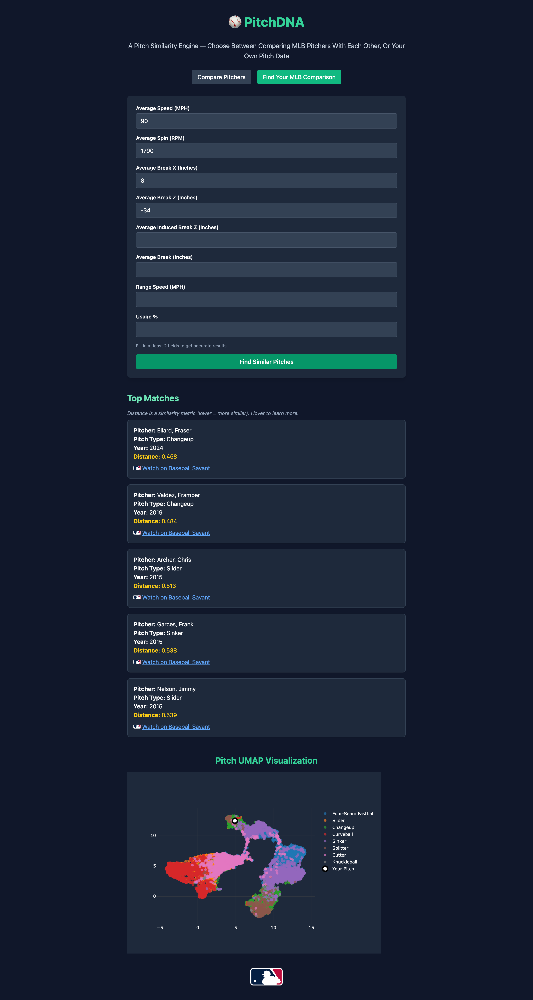
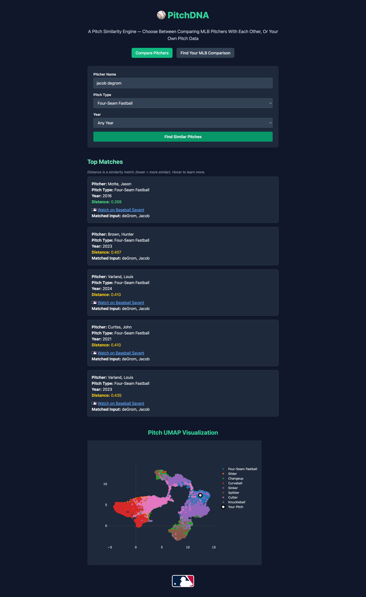

# ⚾ PitchDNA

A full-stack baseball pitch comparison engine that uses machine learning and visual analytics to help players, coaches, and scouts find the most similar MLB pitches — based on mechanics, spin, movement, and velocity.

[🔗 Live Demo](http://pitchdna-frontend.s3-website-us-west-1.amazonaws.com/)

---

## 🚀 Features

- 🔍 **Compare by Player Name** – Enter an MLB pitcher, pitch type, and year to find similar pitches
- 🧠 **Compare by Pitch Characteristics** – Enter metrics like speed, spin, and movement to find your closest MLB comps
- 📊 **UMAP Visualization** – Visual map of pitch similarity across all MLB players
- 🧬 **K-Nearest Neighbors (KNN)** – Backend model to identify pitch similarity based on numerical features
- 🎥 **Statcast Video Integration** – Click to watch matched pitches in real MLB game footage
- 🤖 **Fuzzy Name Matching** – Handles name typos or loose inputs like “DeGrom” or “Shohei”
- 💻 **Deployed Full Stack** – Frontend (React on S3), Backend (FastAPI on EC2), API connected via Axios

---

## 💡 Why I Built It

As someone diving into both **AI/ML** and **cloud architecture**, I wanted to:
- Build a real-world application using **machine learning + sports data**
- Practice **React and FastAPI** integration
- Learn how to **deploy and maintain live apps on AWS**
- Create something useful and visual that combines my passions for **baseball and tech**

---

## 🛠️ Tech Stack

| Layer | Tools |
|-------|-------|
| **Frontend** | React, TailwindCSS, Axios, Plotly.js |
| **Backend** | FastAPI, Scikit-learn (KNN + UMAP), Pandas |
| **Deployment** | AWS S3 (frontend), EC2 + PM2 (backend), Git, SSH |
| **Data** | MLB Statcast (public), UMAP-coordinates precomputed |

---

## 🧠 How It Works

- User enters either:
  - a pitcher name + pitch type
  - or raw pitch data (e.g., velocity, spin, break)
- The backend performs a **KNN search** against preprocessed Statcast data
- For feature inputs, it also **projects the input into UMAP space**
- Results are returned with:
  - Similar pitch entries
  - A UMAP chart with the user's pitch visualized
  - Statcast video links (via fuzzy-matched play ID logic)

## Compare by Features

## Compare by Player

---

## 📦 Deployment Architecture

React (S3) ←→ FastAPI (EC2) ←→ KNN Model & Statcast Data
        ↑                      ↓
   Browser UI           UMAP Projection
                        + Statcast Video Resolver

Backend is managed via `pm2` to ensure reliability across EC2 reboots.

---

## 🧪 What I Learned

- Building a full stack React/FastAPI ML-powered web app
- Deploying scalable apps with AWS (EC2, S3, PM2)
- UMAP and KNN for real-world similarity search
- Handling fuzzy string matching and dynamic routing
- Managing CORS, env variables, and cross-origin deployment

---

## ✍️ Future Improvements

- Add pitch overlays or charted movement animations
- Add user login to save favorite comparisons
- Enhance visual clustering with tooltips and filters
- Add a database (PostgreSQL or DynamoDB) for persistent pitch data

---

## 📂 Project Structure

pitchdna-frontend/
  ├── src/
  ├── public/
  └── .env
pitchdna-backend/
  ├── main.py
  ├── model/
  └── data/

---

## 🔗 Try It Live

[🌐 Open PitchDNA](http://pitchdna-frontend.s3-website-us-west-1.amazonaws.com/)

Or clone and run locally (instructions coming soon).
