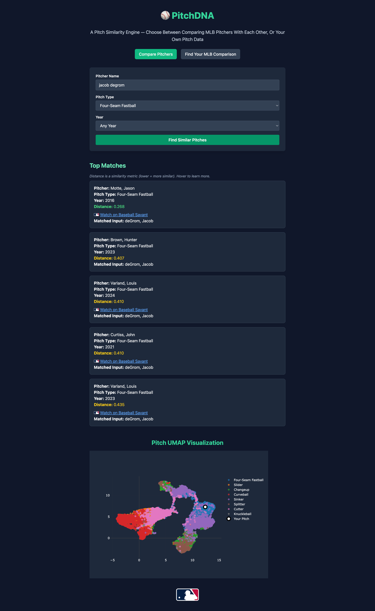
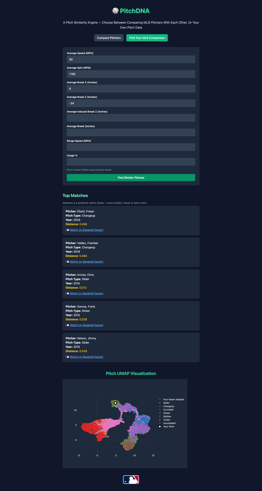

# ⚾ PitchDNA

PitchDNA is a full-stack machine learning web application that helps players, coaches, and scouts find the most similar MLB pitches — based on spin, velocity, and movement. It combines a user-friendly UI, a fast backend API, UMAP visualizations, and real MLB video footage via Statcast.

[🔗 Live Demo](http://pitchdna-frontend.s3-website-us-west-1.amazonaws.com/)

---

## 🚀 Features

- 🔍 **Compare by Player Name** – Search for similar pitches by entering pitcher, pitch type, and year
- 🧠 **Compare by Pitch Characteristics** – Input raw pitch metrics to find your closest MLB comps
- 📊 **UMAP Visualization** – 2D map of pitch similarity across the league with dynamic user pitch marker
- 🎥 **Statcast Video Integration** – Click to watch matched pitches via Baseball Savant
- 🧬 **K-Nearest Neighbors (KNN)** – Backend ML model for pitch similarity
- 🤖 **Fuzzy Matching** – Handles imprecise player name inputs
- 💻 **Deployed Full Stack** – React frontend on S3, FastAPI backend on EC2, connected via Axios

---

## 📦 Deployment Architecture

```text
        +-------------------------+
        |     Browser UI         |
        | (React App on S3)      |
        +-----------+------------+
                    |
             HTTP/API Requests
                    |
        +-----------v------------+
        |   FastAPI Backend (EC2)|
        |  Served via Uvicorn +  |
        |    Managed by PM2      |
        +-----------+------------+
                    |
        |-----------------------------|
        |    Preprocessed Statcast    |
        |   Data + KNN + UMAP Model   |
        |-----------------------------|
                    |
         Statcast Video Resolver Logic
```

- **Frontend**: Hosted on AWS S3
- **Backend**: FastAPI app on EC2 managed by PM2 and served using Uvicorn
- **Data**: Statcast + UMAP + fuzzy-matched video links

---

## 🧱 Why I Didn't Use Docker

For this version of PitchDNA, I opted for a direct EC2 deployment using a virtual machine and process manager (PM2). This choice allowed me to:
- Focus on building and deploying the ML-powered application logic
- Gain hands-on experience configuring persistent services without orchestration
- Keep deployment simple and transparent for portfolio/demo purposes

While containerization with Docker or ECS would improve portability, this project demonstrates a realistic EC2-based production deployment that mirrors many real-world setups.

---

## 🧠 How It Works

Users can search by:
- **MLB Pitcher + pitch type + year**, or
- **Manual input of pitch characteristics**

Backend:
- Finds matches using KNN
- Projects features into UMAP space
- Builds video links using StatsAPI and fuzzy name resolution
- Returns top 5 comps + UMAP chart

---

## 📁 Data Overview

Each CSV in `backend/data/` serves a purpose in the transformation pipeline:

- **`pitcher_stats_{year}.csv`**  
  Raw data from Baseball Savant. Contains pitch metrics like spin, speed, movement, and pitcher metadata.

- **`pitcher_stats_combined_2015_2025.csv`**  
  Merged raw data from all years into a single CSV for unified processing.

- **`pitcher_long_format.csv`**  
  Reformats combined data into a "long" format — one row per pitch.

- **`pitcher_long_format_with_umap.csv`**  
  Adds UMAP coordinates for each pitch for similarity visualization.

- **`pitcher_long_format_with_validated_pitchers.csv`**  
  Intermediate output used to check the accuracy of pitch-to-video matching using fuzzy name and ID matching. Identifies mismatches in prior linking.

- **`pitcher_verified_ids_with_gamepk_pitchnum.csv`**  
  Uses pybaseball and Euclidean distance to match each row to a pitch in an MLB game, extracting `gamepk` and `pitch_number`.

- **`final_dataset_pitchDNA.csv`**  
  Final dataset used in production. Created by `Get_working_URLs.py`, this file combines validated pitch data with the correct playId and constructs working Statcast video URLs.

---

## 🧪 Logging

Logging is implemented via Python's `logging` module. The backend logs key events:
- Incoming API requests
- Similarity matches and scores
- Fuzzy name resolution
- Video link generation success/failure

This helps track performance and debug production issues.

---

## 🛠️ Tech Stack

| Layer        | Tools                            |
|--------------|----------------------------------|
| **Frontend** | React, TailwindCSS, Axios, Plotly |
| **Backend**  | FastAPI, Scikit-learn, Pandas     |
| **Deployment** | AWS S3, EC2, PM2, Uvicorn, Git |
| **ML**       | KNN, UMAP                        |
| **Data**     | Statcast, CSVs, StatsAPI         |

---

## 🧾 Running the App Locally

### Prerequisites
- Node.js, Python 3.9+, Git
- AWS CLI (optional)

### 1. Clone the Repo
```bash
git clone https://github.com/yourusername/pitchdna.git
cd pitchdna
```

### 2. Backend Setup
```bash
cd backend/api
python -m venv .venv
source .venv/bin/activate
pip install -r ../requirements.txt
uvicorn main:app --reload
```

### 3. Frontend Setup
```bash
cd pitchdna-frontend
npm install
npm run dev
```

---

## 🧪 What I Learned

- End-to-end full stack ML app deployment (React + FastAPI)
- UMAP + KNN for real-world pitch similarity
- Production deployment on AWS using EC2 and PM2
- Fuzzy matching and StatsAPI integration
- Handling cross-origin deployments and env config

---

## 🔮 Future Work

- Add a Docker-based deployment option
- Create login accounts to save user comps
- Add dynamic pitch overlays and charts
- Move to a Postgres backend for persistence

---

## 📸 Screenshots

  

